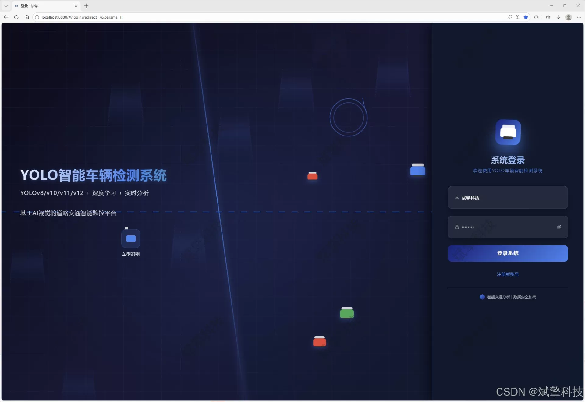
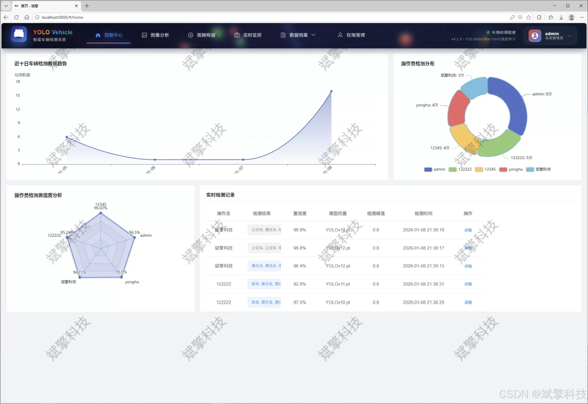
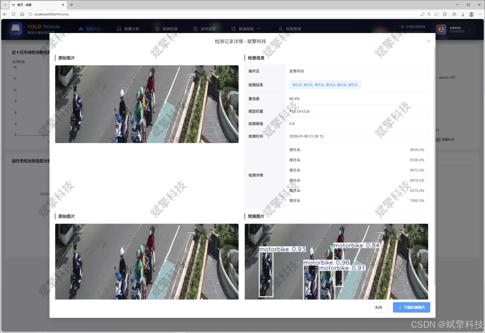
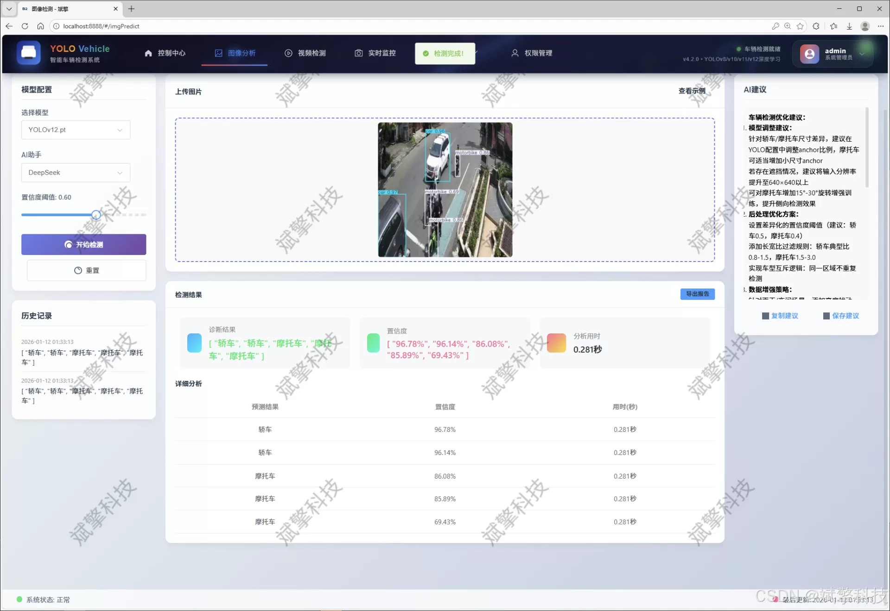
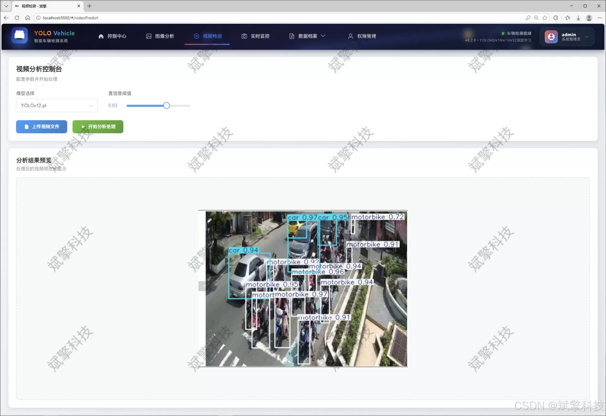
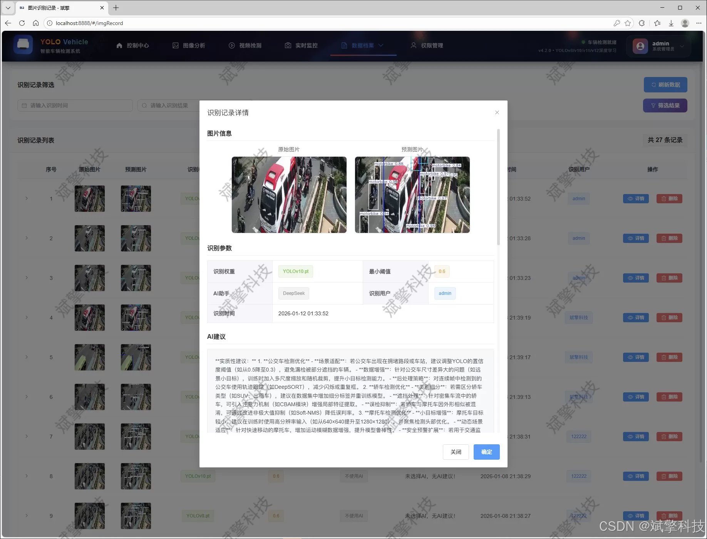
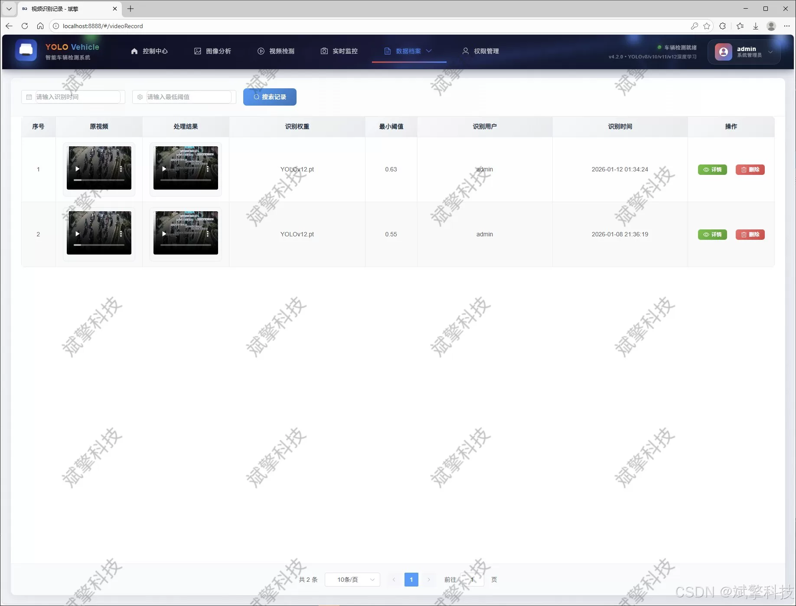
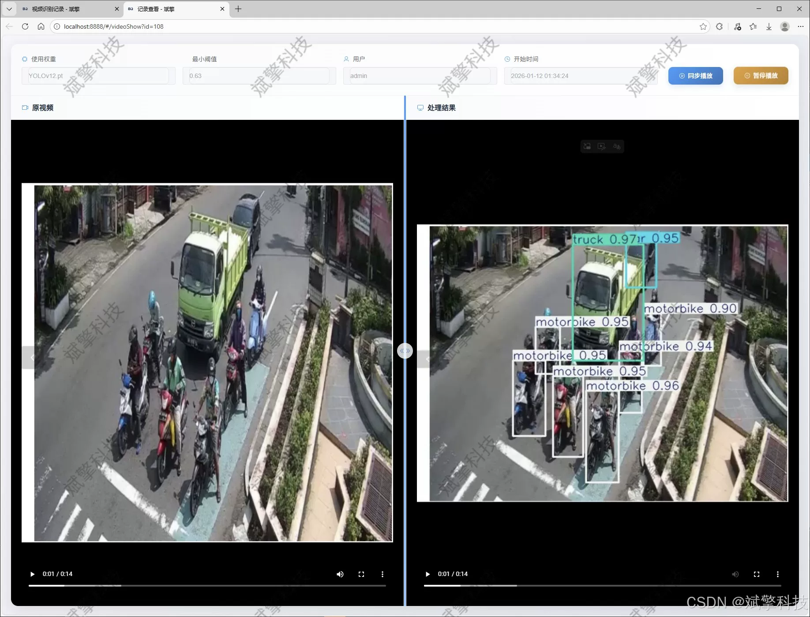
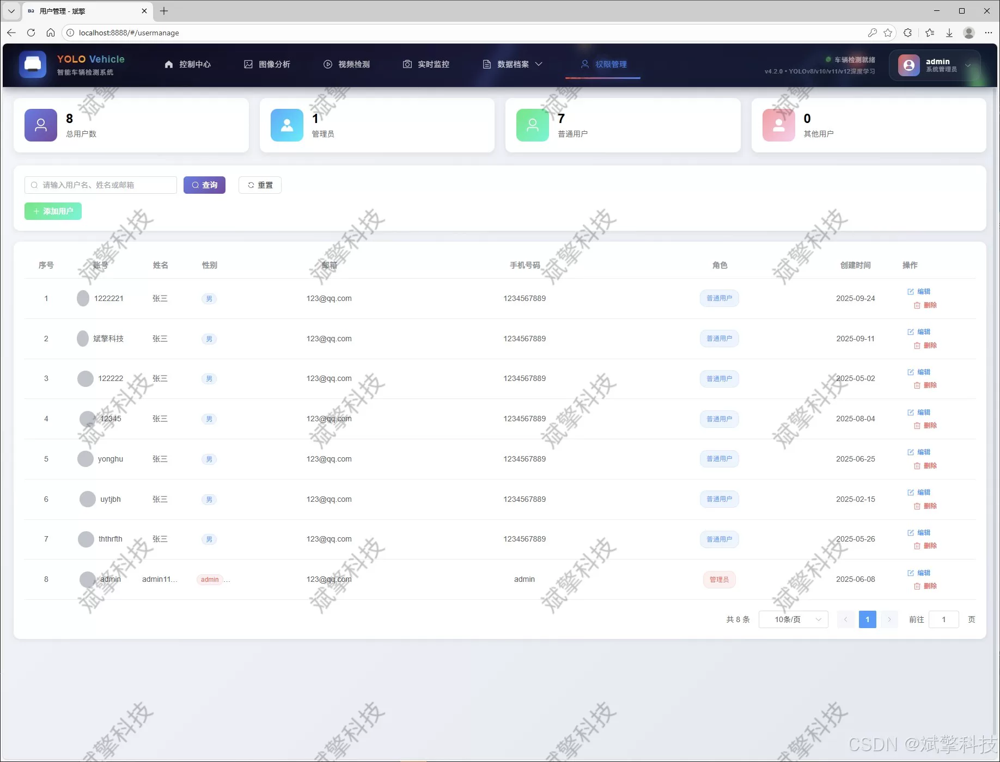

# YOLO+DeepSeek vehicle recognition detection

## Body

YOLO+DeepSeek vehicle recognition detection system based on YOLO deep learning and the large model of Qianwen and DeepSeek (DeepSeek intelligent analysis + web interaction interface + front-end separation + YOLO data + YOLOv8/YOLOv10/YOLOv11/YOLOv12)

The project aims to design and implement a comprehensive vehicle recognition detection system that integrates the latest YOLO series models, SpringBoot backend framework, and DeepSeek large model intelligent analysis with a modern Web interaction interface. The core of the system adopts a front-end and back-end separation architecture, where the front end is responsible for user interaction and result display, while the back end focuses on complex model inference and business logic processing. They communicate through RESTful APIs, ensuring the maintainability, scalability, and high performance of the system.

At the algorithmic level, the system innovatively integrates four advanced detection models: YOLOv8, YOLOv10, YOLOv11, and YOLOv12. It supports users to switch and compare dynamically according to different precision and speed requirements, providing a flexible solution for vehicle detection tasks. The system detects common road vehicles such as buses, cars, motorcycles, and trucks (corresponding to nc=4) and trains and evaluates the model based on a dataset of 1000 carefully labeled images (750 training images, 100 validation images, and 150 test images). This ensures the model's generalization ability in real-world scenarios.

In terms of functionality, the system has established a complete user management system, achieving user registration, login (including password security detection), and permission control based on MySQL database. Administrators have the global management capability to add, delete, modify, and query users in the system, while ordinary users can modify personal information, profile pictures, and passwords in their personal center. The core detection functions of the system cover three modes: image upload detection, video file analysis, and real-time live media detection from cameras. All detection records (including time, target category, confidence level, original file path, and result file path) are persistently stored in the database for subsequent querying, statistical analysis, and analysis.

Functional module

✅ User Login and Registration: Supports password detection, saves to MySQL database.

✅ Supports four YOLO model switches, YOLOv8, YOLOv10, YOLOv11, YOLOv12.

✅ Information Visualization, Data Visualization.

✅ Image detection supports AI analysis functions, deepseek and Qianwen.

✅ Supports image detection, video detection, and real-time camera detection. The results are saved to a MySQL database.

✅ Picture recognition record management, video recognition record management and camera recognition record management.

✅ User Management Module, administrators can add, delete, modify, and query users.

✅ Personal center, can modify their own information, password name profile picture and so on.

There is no Lunwen writing service, nor any Lunwen.

## Images

## Payment

Here is a pay link on Stripe ( https://buy.stripe.com/3cs8yP7sY87d0vu9AB ). Please contact me lonlonago@foxmail.com after funding $89, and I will send you a complete data files , thank you!

